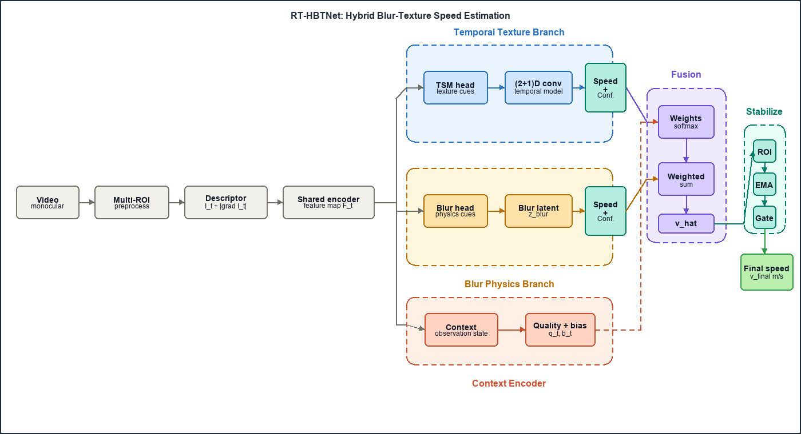

# RT-HBTNet: Real-Time Hybrid Blur-Texture Network

[](#)
[](LICENSE)

> Monocular video speed estimation with separate blur-physics and temporal-texture branches for low-light, motion-blur conveyor scenarios.

## 📌 Abstract

RT-HBTNet is a research prototype for estimating conveyor belt speed from monocular video without sensors, encoders, lasers, or heavy optical-flow inference at runtime. The model combines a Temporal Texture Branch, a Blur Physics Branch, a Context Encoder, confidence-aware fusion, and temporal stabilization.

Because no public dataset jointly provides conveyor video, blur cues, temporal motion, calibrated speed, and ground truth suitable for fair comparison, the data pipeline is designed around dataset families rather than a single fixed benchmark. Blur cues can be pretrained from paired degraded/reference image data, temporal cues can be pretrained from frame+flow data, and final metric speed should be calibrated or fine-tuned with site-specific labeled video.

## 🏗️ Architecture



Architecture source: [architect.tex](architect.tex)

## 🚀 Getting Started

### Requirements

- Python 3.8+
- PyTorch
- torchvision
- OpenCV
- NumPy
- PyYAML
- tqdm
- pandas
- matplotlib
- pytest

### Installation

```bash
git clone https://github.com/user/rt_hbtnet
cd rt_hbtnet
pip install -r requirements.txt
```

For Windows virtual environments:

```powershell
python -m venv .venv
.venv\Scripts\activate
pip install -r requirements.txt
```

## 📂 Dataset

Recommended layout:

```text
data/
  raw/
    paired_blur/
      train/<sequence>/blur/*.png
      train/<sequence>/sharp/*.png
      test/<sequence>/blur/*.png
      test/<sequence>/sharp/*.png
    flow_temporal/
      training/final/<scene>/frame_*.png
      training/flow/<scene>/frame_*.flo
    site_speed/
      videos/*.mp4
  manifests/
    site_speed/labels.csv
    paired_blur/train.csv
    flow_temporal/train.csv
  processed/
    paired_blur/
    flow_temporal/
  splits/
    paired_blur/
    flow_temporal/
    site_speed/
```

For metric speed training, create a labeled-video CSV:

```csv
video_path,start_frame,end_frame,speed_mps
belt_001.mp4,0,300,1.25
belt_002.mp4,50,350,2.10
```

Relative `video_path` values are resolved through `--video-root`.

Supported dataset families:

- `video`: site-specific labeled conveyor videos with `speed_mps`.
- `paired_blur`: generic paired degraded/reference images for blur-branch pretraining.
- `flow_temporal`: generic frame sequence + dense flow data for temporal-branch pretraining.
- `gopro_blur`: convenience preset for GOPRO-style paired blur data.
- `mpi_sintel`: convenience preset for MPI Sintel-style frame+flow data.

## 🏋️ Training

Train with site-specific labeled video:

```bash
python scripts/train.py --config configs/default.yaml --dataset video --labels data/manifests/site_speed/labels.csv --video-root data/raw/site_speed/videos
```

Pretrain only the blur branch:

```bash
python scripts/train.py --config configs/default.yaml --dataset paired_blur --branch blur --data-root data/raw/paired_blur --save-dir runs/pretrain_blur
```

Pretrain only the temporal branch:

```bash
python scripts/train.py --config configs/default.yaml --dataset flow_temporal --branch temporal --data-root data/raw/flow_temporal --save-dir runs/pretrain_temporal
```

Checkpoints and logs are written to `runs/train` by default:

- `best.pt`
- `last.pt`
- `config.yaml`
- `history.csv`
- `training_curves.png`

## 🔎 Inference

Run inference on a video:

```bash
python scripts/infer_video.py --config configs/default.yaml --weights runs/train/best.pt --video data/raw/site_speed/videos/belt_001.mp4
```

Use a fixed ROI:

```bash
python scripts/infer_video.py --config configs/default.yaml --weights runs/train/best.pt --video data/raw/site_speed/videos/belt_001.mp4 --roi "100,100,400,160"
```

Run headless and save annotated output:

```bash
python scripts/infer_video.py --config configs/default.yaml --weights runs/train/best.pt --video data/raw/site_speed/videos/belt_001.mp4 --no-display --save-output runs/infer/output.mp4
```

## 📊 Results

| Method | MAE (m/s) | RMSE | MAPE (%) |
|--------|-----------|------|----------|
| RT-HBTNet | TBD | TBD | TBD |

Report site-specific calibration settings, ROI policy, camera FPS, and train/validation split when filling this table.

## 📁 Project Structure

```text
configs/      YAML configuration files
datasets/     Dataset adapters for video, paired blur, and frame+flow data
models/       RT-HBTNet branches, fusion blocks, and model factory
scripts/      Training, inference, and benchmark entry points
tests/        Pytest coverage for datasets, ROI, filters, fusion, and model shapes
utils/        Preprocessing, ROI detection, metrics, calibration, and visualization
architect.tex Architecture diagram source
```

## 🧪 Testing

```bash
pytest
```

Focused smoke check:

```bash
pytest tests/test_model_shapes.py tests/test_factories.py
```

## ⚠️ Limitations

This is a research prototype. Do not treat its output as production-grade measurement without validation against calibrated ground truth.

CV-only monocular video cannot reliably estimate absolute speed if the belt has no useful visual texture, repeated ambiguous patterns, or no motion-induced signal. Metric speed requires known reference-speed data or pixel-to-meter calibration, and camera position, lens, zoom, and ROI should remain fixed after calibration.
